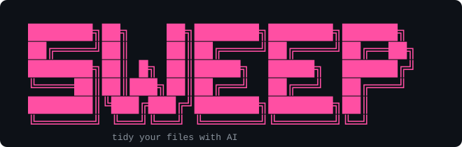

<div align="center">



**Free, open-source CLI that audits your computer, finds where the clutter lives, and tidies it with Claude — safely.**

[](#license)
[](#requirements)
[](#)
[](https://claude.com/claude-code)

</div>

> Run `sweep`. It scans your folders, tells you where the gigabytes and mess are — worst first — and tidies them one click at a time. Nothing moves without your `y`. Everything is undoable.

---

## ⚡ Quick start

No install, no API key needed if you have **[Claude Code](https://claude.com/claude-code)**:

```bash
npx @mossab/sweep --claude-code
```

…or bring your own [Claude API key](https://console.anthropic.com/):

```bash
ANTHROPIC_API_KEY=sk-ant-... npx @mossab/sweep
```

sweep audits your content folders, shows a ranked report, and hands you a menu:

```text
╭─ Report ──────────────────────────────────────────────╮
│ 1) Downloads    1.6 GB · 760 files · ~200 MB duplicates │
│ 2) Desktop      820 MB · 240 files · very messy         │
│ 3) Pictures     3.1 GB · sorted, minor cleanup          │
╰────────────────────────────────────────────────────────╯
  Pick a number to tidy, A to tidy all, Q to quit
```

Pick a number to tidy that zone, **`A`** to tidy everything, **`Q`** to quit.

---

## 🛡️ Safe by default

- **Dry-run first** — you see the full plan and confirm `y/N` before a single file moves.
- **No real deletion** — "deleted" files are quarantined to `~/.sweep/trash/<timestamp>/`.
- **Full undo** — `sweep undo` reverts the last run instantly.
- **Bounded** — tidying only ever touches your content folders. sweep refuses `/` and your bare home, and skips system/noise dirs (`node_modules`, `.git`, …). The audit is read-only.

---

## 🎯 Usage

**Audit the whole computer** (the headline flow):

```bash
sweep                # or: sweep -c   (Claude Code subscription)
```

**Tidy one folder directly:**

```bash
sweep ~/Downloads                 # organize (default)
sweep ~/Downloads --mode clean    # junk, duplicates, clutter
```

**Free-form instruction:**

```bash
sweep ~/Photos -i "sort photos by year"
sweep ~/Desktop -i "keep only PDFs, move the rest into a subfolder"
```

**Undo the last run:**

```bash
sweep undo
```

---

## 🔍 How it works

1. **Local scan** — sweep reads names, sizes, dates, types and duplicate hashes. Only a **compact summary** ever leaves your machine.
2. **AI plan** — Claude returns a short report and a compact tidy *strategy* (folder taxonomy + rules) — never one instruction per file, so it stays fast on huge folders.
3. **Local expansion** — sweep turns that strategy into a concrete move/quarantine plan on your machine.
4. **You confirm** — nothing happens until you type `y`.
5. **Execute & undo** — files are moved or quarantined; `sweep undo` puts everything back.

---

## ✅ Requirements

- Node.js **≥ 20**
- **Either** a Claude API key (`ANTHROPIC_API_KEY`) — get one at [console.anthropic.com](https://console.anthropic.com/) — **or** [Claude Code](https://claude.com/claude-code) installed and logged in, then run with `--claude-code`.

---

## 🤝 Contributing

Issues and PRs welcome. `npm install` then `npm test` (vitest). The codebase is small, typed, and modular — start in `src/`.

## License

MIT © 2026 Mossab — see [`LICENSE`](LICENSE).
